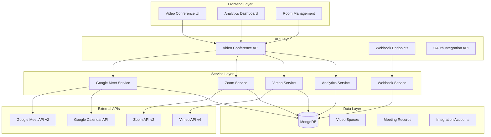

# Design Document

## Overview

The Video Conferencing Platform is a centralized system that unifies Google Meet, Zoom, and Vimeo integrations within the existing Next.js application architecture. The platform follows the established patterns from the Drive and Calendar modules, providing comprehensive room management, real-time analytics, automated recording handling, and unified reporting across all video conferencing providers.

The design leverages the existing authentication system, database structure, and API patterns while introducing new domain-specific models and services for video conferencing management.

## Architecture

### High-Level Architecture



### Module Structure

Following the existing project patterns, the video conferencing platform will be organized as:

```
src/features/video-conferencing/
├── types/
│   ├── index.ts              # Unified types
│   ├── meet.ts               # Google Meet types
│   ├── zoom.ts               # Zoom types
│   └── vimeo.ts              # Vimeo types
├── validations/
│   ├── index.ts              # Unified validations
│   ├── meet.ts               # Google Meet validations
│   ├── zoom.ts               # Zoom validations
│   └── vimeo.ts              # Vimeo validations
├── services/
│   ├── auth/
│   │   ├── GoogleMeetAuthProvider.ts
│   │   ├── ZoomAuthProvider.ts
│   │   └── VimeoAuthProvider.ts
│   ├── providers/
│   │   ├── GoogleMeetService.ts
│   │   ├── ZoomService.ts
│   │   └── VimeoService.ts
│   ├── analytics/
│   │   ├── AnalyticsService.ts
│   │   └── ReportingService.ts
│   ├── webhooks/
│   │   └── WebhookService.ts
│   └── VideoConferencingService.ts
├── components/
│   ├── rooms/
│   │   ├── RoomList.tsx
│   │   ├── RoomCard.tsx
│   │   ├── RoomForm.tsx
│   │   └── RoomStatus.tsx
│   ├── analytics/
│   │   ├── MeetingAnalytics.tsx
│   │   ├── ParticipantList.tsx
│   │   ├── TranscriptionViewer.tsx
│   │   └── ChatViewer.tsx
│   ├── calendar/
│   │   └── CalendarIntegration.tsx
│   └── shared/
│       ├── ProviderIcon.tsx
│       └── StatusBadge.tsx
└── hooks/
    ├── useVideoRooms.ts
    ├── useMeetingAnalytics.ts
    └── useRealTimeStatus.ts
```

## Components and Interfaces

### Core Data Models

#### VideoSpace Model

```typescript
model VideoSpace {
  id                    String                @id @default(auto()) @map("_id") @db.ObjectId

  // Basic Information
  name                  String
  description           String?
  provider              VideoProvider         // MEET, ZOOM, VIMEO
  status                VideoSpaceStatus      // ACTIVE, INACTIVE, DISABLED, EXPIRED

  // Provider Integration
  providerRoomId        String                // External room ID
  providerJoinUri       String                // Join URL
  providerData          Json?                 // Provider-specific data

  // Configuration
  settings              VideoSpaceSettings?

  // Ownership and Access
  ownerId               String                @db.ObjectId
  owner                 User                  @relation(fields: [ownerId], references: [id])
  cohort                String?               // For grouping sessions
  tags                  String[]              // Searchable tags

  // Calendar Integration
  addedToCalendar       Boolean               @default(false)
  calendarEventId       String?

  // Timestamps
  createdAt             DateTime              @default(now())
  updatedAt             DateTime              @updatedAt
  lastActiveAt          DateTime?

  // Relations
  aliases               LinkAlias[]
  meetingRecords        MeetingRecord[]
  integrationAccount    IntegrationAccount    @relation(fields: [integrationAccountId], references: [id])
  integrationAccountId  String                @db.ObjectId

  @@map("videoSpaces")
  @@index([provider, status])
  @@index([ownerId])
  @@index([cohort])
}
```

#### MeetingRecord Model

```typescript
model MeetingRecord {
  id                    String                @id @default(auto()) @map("_id") @db.ObjectId

  // Basic Information
  videoSpaceId          String                @db.ObjectId
  videoSpace            VideoSpace            @relation(fields: [videoSpaceId], references: [id])

  // Meeting Details
  providerMeetingId     String                // External meeting ID
  title                 String?
  startTime             DateTime
  endTime               DateTime?
  duration              Int?                  // Duration in minutes
  status                MeetingStatus         // SCHEDULED, ACTIVE, ENDED, CANCELLED

  // Participant Summary
  totalParticipants     Int                   @default(0)
  maxConcurrentUsers    Int                   @default(0)

  // Provider Data
  providerData          Json?                 // Raw provider data

  // Timestamps
  createdAt             DateTime              @default(now())
  updatedAt             DateTime              @updatedAt

  // Relations
  participants          MeetingParticipant[]
  transcriptEntries     MeetingTranscriptEntry[]
  chatMessages          MeetingChatMessage[]
  recordingFiles        MeetingRecordingFile[]

  @@map("meetingRecords")
  @@index([videoSpaceId])
  @@index([startTime])
  @@index([status])
}
```

#### IntegrationAccount Model

```typescript
model IntegrationAccount {
  id                    String                @id @default(auto()) @map("_id") @db.ObjectId

  // Account Information
  provider              VideoProvider
  accountName           String                // Display name
  accountEmail          String?               // Associated email

  // Authentication
  accessToken           String                // Encrypted
  refreshToken          String?               // Encrypted
  tokenExpiry           DateTime?
  scopes                String[]              // Granted permissions

  // Account Status
  status                IntegrationStatus     // ACTIVE, EXPIRED, REVOKED, ERROR
  lastSyncAt            DateTime?

  // Ownership
  userId                String                @db.ObjectId
  user                  User                  @relation(fields: [userId], references: [id])

  // Configuration
  webhookConfig         ProviderWebhookConfig?

  // Timestamps
  createdAt             DateTime              @default(now())
  updatedAt             DateTime              @updatedAt

  // Relations
  videoSpaces           VideoSpace[]

  @@map("integrationAccounts")
  @@unique([provider, accountEmail])
  @@index([userId])
  @@index([provider, status])
}
```

### Service Layer Architecture

#### VideoConferencingService (Main Orchestrator)

```typescript
export class VideoConferencingService {
  private meetService: GoogleMeetService;
  private zoomService: ZoomService;
  private vimeoService: VimeoService;
  private analyticsService: AnalyticsService;

  async createVideoSpace(data: CreateVideoSpaceRequest): Promise<VideoSpace>;
  async getVideoSpaces(filters: VideoSpaceFilters): Promise<VideoSpace[]>;
  async updateVideoSpace(
    id: string,
    data: UpdateVideoSpaceRequest
  ): Promise<VideoSpace>;
  async deleteVideoSpace(id: string): Promise<void>;
  async getRealTimeStatus(id: string): Promise<VideoSpaceStatus>;
  async syncMeetingData(spaceId: string): Promise<MeetingRecord[]>;
}
```

#### Provider-Specific Services

##### GoogleMeetService

```typescript
export class GoogleMeetService {
  private authProvider: GoogleMeetAuthProvider;

  async createSpace(config: MeetSpaceConfig): Promise<MeetSpace>;
  async updateSpace(
    spaceId: string,
    config: Partial<MeetSpaceConfig>
  ): Promise<MeetSpace>;
  async getSpaceStatus(spaceId: string): Promise<SpaceStatus>;
  async getConferenceRecords(spaceId: string): Promise<ConferenceRecord[]>;
  async getTranscripts(conferenceId: string): Promise<TranscriptEntry[]>;
  async getRecordings(conferenceId: string): Promise<Recording[]>;
  async getParticipants(conferenceId: string): Promise<Participant[]>;
}
```

##### ZoomService

```typescript
export class ZoomService {
  private authProvider: ZoomAuthProvider;

  async createMeeting(config: ZoomMeetingConfig): Promise<ZoomMeeting>;
  async updateMeeting(
    meetingId: string,
    config: Partial<ZoomMeetingConfig>
  ): Promise<ZoomMeeting>;
  async getMeetingStatus(meetingId: string): Promise<MeetingStatus>;
  async getMeetingReports(meetingId: string): Promise<MeetingReport>;
  async getParticipants(meetingId: string): Promise<ZoomParticipant[]>;
  async getRecordings(meetingId: string): Promise<ZoomRecording[]>;
}
```

#### AnalyticsService

```typescript
export class AnalyticsService {
  async generateMeetingReport(meetingId: string): Promise<MeetingAnalytics>;
  async getParticipantAnalytics(
    filters: AnalyticsFilters
  ): Promise<ParticipantAnalytics>;
  async getCohortStatistics(
    cohort: string,
    dateRange: DateRange
  ): Promise<CohortStats>;
  async exportReportData(
    filters: ReportFilters,
    format: ExportFormat
  ): Promise<Buffer>;
  async getEngagementMetrics(spaceId: string): Promise<EngagementMetrics>;
}
```

#### WebhookService

```typescript
export class WebhookService {
  async handleMeetWebhook(
    payload: MeetWebhookPayload,
    signature: string
  ): Promise<void>;
  async handleZoomWebhook(
    payload: ZoomWebhookPayload,
    signature: string
  ): Promise<void>;
  async handleVimeoWebhook(
    payload: VimeoWebhookPayload,
    signature: string
  ): Promise<void>;
  async validateWebhookSignature(
    payload: string,
    signature: string,
    provider: VideoProvider
  ): Promise<boolean>;
  async processMeetingEndedEvent(event: MeetingEndedEvent): Promise<void>;
}
```

## Data Models

### Enums and Types

```typescript
enum VideoProvider {
  MEET = "MEET",
  ZOOM = "ZOOM",
  VIMEO = "VIMEO",
}

enum VideoSpaceStatus {
  ACTIVE = "ACTIVE",
  INACTIVE = "INACTIVE",
  DISABLED = "DISABLED",
  EXPIRED = "EXPIRED",
}

enum MeetingStatus {
  SCHEDULED = "SCHEDULED",
  ACTIVE = "ACTIVE",
  ENDED = "ENDED",
  CANCELLED = "CANCELLED",
}

enum IntegrationStatus {
  ACTIVE = "ACTIVE",
  EXPIRED = "EXPIRED",
  REVOKED = "REVOKED",
  ERROR = "ERROR",
}
```

### Configuration Models

```typescript
interface VideoSpaceSettings {
  // Recording settings
  autoRecord: boolean;
  recordingFormat: "MP4" | "AUDIO_ONLY";

  // Transcription settings
  enableTranscription: boolean;
  transcriptionLanguage: string;

  // Access control
  requireAuthentication: boolean;
  allowedDomains: string[];
  maxParticipants: number;

  // Meeting behavior
  muteOnEntry: boolean;
  enableChat: boolean;
  enableScreenShare: boolean;

  // Provider-specific settings
  providerSettings: Json;
}

interface ProviderWebhookConfig {
  webhookUrl: string;
  secretToken: string;
  events: string[];
  isActive: boolean;
  lastDeliveryAt: DateTime?;
  failureCount: number;
}
```

## Error Handling

### Error Types

```typescript
export class VideoConferencingError extends Error {
  constructor(
    message: string,
    public code: string,
    public provider?: VideoProvider,
    public originalError?: Error
  ) {
    super(message);
    this.name = "VideoConferencingError";
  }
}

export class ProviderAuthError extends VideoConferencingError {
  constructor(provider: VideoProvider, message: string) {
    super(
      `Authentication failed for ${provider}: ${message}`,
      "AUTH_ERROR",
      provider
    );
  }
}

export class RoomCreationError extends VideoConferencingError {
  constructor(provider: VideoProvider, message: string) {
    super(
      `Failed to create room in ${provider}: ${message}`,
      "ROOM_CREATION_ERROR",
      provider
    );
  }
}

export class WebhookValidationError extends VideoConferencingError {
  constructor(provider: VideoProvider, message: string) {
    super(
      `Webhook validation failed for ${provider}: ${message}`,
      "WEBHOOK_VALIDATION_ERROR",
      provider
    );
  }
}
```

### Error Handling Strategy

1. **API Level**: Catch and transform provider-specific errors into standardized error types
2. **Service Level**: Implement retry logic with exponential backoff for transient failures
3. **Database Level**: Use transactions for multi-step operations to ensure data consistency
4. **Webhook Level**: Implement dead letter queues for failed webhook processing
5. **UI Level**: Display user-friendly error messages with actionable guidance

## Testing Strategy

### Unit Testing

- **Service Layer**: Mock external API calls and test business logic
- **Validation Layer**: Test Zod schemas with valid and invalid data
- **Utility Functions**: Test data transformation and formatting functions
- **Error Handling**: Test error scenarios and recovery mechanisms

### Integration Testing

- **API Endpoints**: Test complete request/response cycles
- **Database Operations**: Test CRUD operations with real database
- **Provider Integration**: Test OAuth flows and API interactions
- **Webhook Processing**: Test webhook signature validation and data processing

### End-to-End Testing

- **Room Management Flow**: Create, configure, and manage video rooms
- **Analytics Flow**: Generate and export meeting reports
- **Calendar Integration**: Test copy-to-calendar functionality
- **Real-time Status**: Test live status updates and synchronization

### Performance Testing

- **Database Queries**: Optimize queries for large datasets (500+ records)
- **API Response Times**: Ensure sub-2-second response times
- **Concurrent Users**: Test system behavior under load
- **Webhook Processing**: Test high-volume webhook processing

### Test Coverage Requirements

- **Minimum Coverage**: 90% for service layer and critical business logic
- **API Coverage**: 100% for all public endpoints
- **Error Scenarios**: Cover all defined error types and recovery paths
- **Provider Integration**: Mock all external API calls for consistent testing

### Testing Tools and Framework

- **Unit Tests**: Vitest with React Testing Library
- **Integration Tests**: Supertest for API testing
- **Database Tests**: In-memory MongoDB for fast test execution
- **Mocking**: MSW (Mock Service Worker) for external API mocking
- **E2E Tests**: Playwright for browser automation testing

The testing strategy ensures reliability, maintainability, and confidence in the video conferencing platform while following the existing project's testing patterns and tools.
