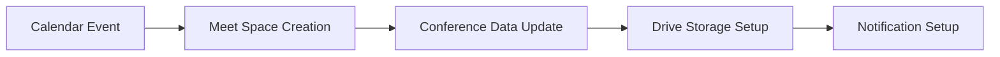
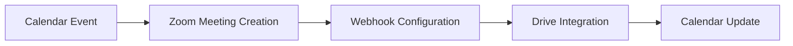

# Meet, Zoom & Vimeo Modules Architecture

## 📋 Overview

Este documento describe la arquitectura completa para la implementación de los módulos Meet, Zoom y Vimeo en el proyecto, basándose en los patrones existentes de Drive y Calendar.

## 🗂️ **Arquitectura Existente**

### **Drive Module**
```
src/features/drive/
├── services/
│   ├── drive/GoogleDriveService.ts          # Servicio principal Google Drive API
│   ├── auth/GoogleAuthProvider.ts           # Autenticación OAuth2
│   ├── hierarchy/hierarchyService.ts        # Gestión de estructura jerárquica
│   └── analyzer/                            # Análisis de archivos y metadatos
├── types/drive.ts                           # Tipos base (DriveFile, DriveFolder)
├── utils/                                   # Utilidades de archivos y carpetas
└── components/                              # Componentes UI específicos
```

### **Calendar Module**
```
src/features/calendar/
├── services/
│   ├── calendar/GoogleCalendarService.ts    # Servicio principal Google Calendar API
│   ├── auth/GoogleCalendarAuthProvider.ts   # Autenticación OAuth2
│   └── validation/CalendarEnvValidator.ts   # Validación de configuración
├── types/calendar.ts                        # Tipos completos (GoogleCalendarEvent, CalendarEventForm)
├── utils/
│   ├── meetUtils.ts                         # Utilidades de Google Meet
│   ├── bulkMeetOperations.ts               # Operaciones masivas de Meet
│   └── eventProcessor.ts                    # Procesamiento de eventos
└── components/CalendarKPIs.tsx              # Componentes UI
```

## 🎯 **Meet Module - Arquitectura Propuesta**

### **Estructura de Archivos**
```
src/features/meet/
├── services/
│   ├── meet/
│   │   ├── GoogleMeetService.ts             # Servicio principal Google Meet API v2
│   │   ├── MeetSpaceService.ts              # Gestión de espacios Meet
│   │   ├── MeetRecordingService.ts          # Gestión de grabaciones
│   │   └── MeetTranscriptionService.ts      # Servicios de transcripción
│   ├── auth/
│   │   └── GoogleMeetAuthProvider.ts        # Autenticación específica Meet
│   ├── ai/
│   │   ├── GeminiNotesService.ts            # Integración Gemini AI
│   │   └── TranscriptionProcessor.ts        # Procesamiento de transcripciones
│   └── validation/
│       └── MeetValidationService.ts         # Validación de configuraciones
├── types/
│   ├── meet.ts                              # Tipos base de Meet
│   ├── space.ts                             # Tipos de espacios Meet
│   ├── recording.ts                         # Tipos de grabación
│   ├── transcription.ts                     # Tipos de transcripción
│   └── participant.ts                       # Gestión de participantes
├── utils/
│   ├── meetLinkGenerator.ts                 # Generación de enlaces
│   ├── participantManager.ts                # Gestión de participantes
│   ├── recordingManager.ts                  # Gestión de grabaciones
│   ├── breakoutRoomsManager.ts              # Salas de grupos
│   └── securityUtils.ts                     # Configuraciones de seguridad
├── components/
│   ├── MeetControls.tsx                     # Controles de reunión
│   ├── SpaceManager.tsx                     # Gestión de espacios
│   ├── ParticipantList.tsx                  # Lista de participantes
│   ├── RecordingStatus.tsx                  # Estado de grabación
│   └── TranscriptionPanel.tsx               # Panel de transcripción
├── hooks/
│   ├── useMeetSpace.ts                      # Hook para espacios Meet
│   ├── useMeetRecording.ts                  # Hook para grabación
│   ├── useMeetTranscription.ts              # Hook para transcripción
│   └── useMeetParticipants.ts               # Hook para participantes
└── constants/
    └── meet.constants.ts                    # Configuraciones y constantes
```

### **API Endpoints**
```
src/app/api/meet/
├── spaces/
│   ├── create/                              # Crear nuevo espacio Meet
│   ├── [id]/
│   │   ├── update/                          # Actualizar configuración
│   │   ├── participants/                    # Gestión participantes
│   │   ├── recording/                       # Control de grabación
│   │   ├── transcription/                   # Control de transcripción
│   │   ├── conference/                      # Gestión de conferencias activas
│   │   └── settings/                        # Configuraciones avanzadas
│   └── bulk/
│       ├── create/                          # Creación masiva
│       └── configure/                       # Configuración masiva
├── recordings/
│   ├── [id]/                                # Gestión individual de grabaciones
│   ├── download/                            # Descarga de grabaciones
│   ├── drive-upload/                        # Subida automática a Drive
│   └── analytics/                           # Análisis de grabaciones
├── transcriptions/
│   ├── [id]/                                # Gestión individual
│   ├── translate/                           # Traducción automática
│   ├── summary/                             # Resumen con IA (Gemini)
│   └── export/                              # Exportar transcripciones
├── participants/
│   ├── [id]/                                # Gestión individual
│   ├── permissions/                         # Permisos de participantes
│   └── analytics/                           # Métricas de participación
└── integration/
    ├── calendar-sync/                       # Sincronización con Calendar
    └── drive-storage/                       # Almacenamiento en Drive
```

## 🔍 **Zoom Module - Arquitectura Propuesta**

### **Estructura de Archivos**
```
src/features/zoom/
├── services/
│   ├── zoom/
│   │   ├── ZoomAPIService.ts                # Servicio principal Zoom API
│   │   ├── ZoomMeetingService.ts            # Gestión de reuniones
│   │   ├── ZoomWebinarService.ts            # Gestión de webinars
│   │   ├── ZoomWebhookService.ts            # Manejo de webhooks
│   │   └── ZoomRecordingService.ts          # Gestión de grabaciones
│   ├── auth/
│   │   └── ZoomAuthProvider.ts              # OAuth2 con Zoom
│   ├── integration/
│   │   ├── CalendarIntegration.ts           # Integración con Calendar
│   │   └── DriveStorageService.ts           # Almacenamiento en Drive
│   └── validation/
│       └── ZoomValidationService.ts         # Validación de configuraciones
├── types/
│   ├── zoom.ts                              # Tipos base de Zoom
│   ├── meeting.ts                           # Tipos de reuniones
│   ├── webinar.ts                           # Tipos de webinars
│   ├── recording.ts                         # Tipos de grabación
│   ├── participant.ts                       # Gestión de participantes
│   └── webhook.ts                           # Tipos de webhooks
├── utils/
│   ├── meetingLinkGenerator.ts              # Generación de enlaces
│   ├── participantManager.ts                # Gestión de participantes
│   ├── recordingProcessor.ts                # Procesamiento de grabaciones
│   ├── pollManager.ts                       # Gestión de encuestas
│   ├── breakoutManager.ts                   # Salas de reuniones
│   ├── securityManager.ts                   # Configuraciones de seguridad
│   └── webhookProcessor.ts                  # Procesamiento de webhooks
├── components/
│   ├── ZoomControls.tsx                     # Controles de Zoom
│   ├── MeetingScheduler.tsx                 # Programador de reuniones
│   ├── WebinarManager.tsx                   # Gestión de webinars
│   ├── RecordingLibrary.tsx                 # Biblioteca de grabaciones
│   ├── ParticipantManager.tsx               # Gestión de participantes
│   └── PollManager.tsx                      # Gestión de encuestas
├── hooks/
│   ├── useZoomMeeting.ts                    # Hook para reuniones
│   ├── useZoomWebinar.ts                    # Hook para webinars
│   ├── useZoomRecording.ts                  # Hook para grabaciones
│   └── useZoomWebhook.ts                    # Hook para webhooks
└── constants/
    └── zoom.constants.ts                    # Configuraciones y constantes
```

### **API Endpoints**
```
src/app/api/zoom/
├── meetings/
│   ├── create/                              # Crear reunión
│   ├── schedule/                            # Programar reunión
│   ├── [id]/
│   │   ├── participants/                    # Gestión participantes
│   │   ├── recording/                       # Control grabación
│   │   ├── polls/                           # Gestión de encuestas
│   │   ├── breakout-rooms/                  # Salas de reuniones
│   │   ├── settings/                        # Configuraciones
│   │   └── analytics/                       # Métricas de reunión
│   └── bulk/                                # Operaciones masivas
├── webinars/
│   ├── create/                              # Crear webinar
│   ├── [id]/
│   │   ├── registration/                    # Gestión de registro
│   │   ├── participants/                    # Gestión participantes
│   │   └── analytics/                       # Métricas de webinar
│   └── bulk/                                # Operaciones masivas
├── recordings/
│   ├── [id]/                                # Gestión individual
│   ├── download/                            # Descarga
│   ├── cloud-storage/                       # Almacenamiento en nube
│   ├── drive-upload/                        # Subida automática a Drive
│   └── transcription/                       # Servicios de transcripción
├── webhooks/
│   ├── configure/                           # Configuración de webhooks
│   ├── handler/                             # Manejo de eventos webhook
│   └── verify/                              # Verificación de webhooks
├── auth/
│   ├── oauth/                               # Flujo OAuth2
│   └── refresh/                             # Renovación de tokens
└── integration/
    ├── calendar-sync/                       # Sincronización con Calendar
    └── drive-integration/                   # Integración con Drive
```

## 📚 **Referencia de Validaciones Zod**

### **🔗 Archivos de Referencia**

Los siguientes archivos contienen las validaciones Zod y tipos TypeScript que deben ser adaptados para nuestros módulos:

- **📁 `.borrar-calendar-and-meet.js`**: Contiene todas las validaciones de entrada y tipos para Google Calendar API v3 y Google Meet API v2
- **📁 `.borrar-calendar-and-meet.ts`**: Definiciones completas de tipos TypeScript para ambas APIs

### **🎯 Tipos y Validaciones a Extraer**

#### **Para Meet Module** (`src/features/meet/types/` y validaciones)
```typescript
// Extraer de .borrar-calendar-and-meet.ts
export interface MeetSpace {
  name: string;
  meetingUri?: string;
  meetingCode?: string;
  config?: SpaceConfig;
  activeConference?: ActiveConference;
}

export interface SpaceConfig {
  accessType?: 'OPEN' | 'TRUSTED' | 'RESTRICTED';
  moderation?: 'ON' | 'OFF';
  artifactConfig?: ArtifactConfig;
  // ... más configuraciones
}

// Validaciones Zod extraer de .borrar-calendar-and-meet.js
const createMeetSpaceSchema = z.object({
  access_type: z.enum(["OPEN", "TRUSTED", "RESTRICTED"]).optional(),
  enable_recording: z.boolean().optional(),
  enable_transcription: z.boolean().optional(),
  enable_smart_notes: z.boolean().optional(),
  // ... más validaciones
});
```

#### **Para Calendar Integration** (`src/features/calendar/types/` extensiones)
```typescript
// Extensiones de tipos existentes para Meet
export interface CalendarEventForm {
  // ... propiedades existentes
  conferenceData?: {
    createRequest?: {
      requestId?: string;
      conferenceSolutionKey?: {
        type: 'hangoutsMeet';
      };
    };
  };
  
  // Nuevas propiedades para Meet avanzado
  meetConfig?: {
    recording?: 'enabled' | 'disabled';
    transcription?: 'enabled' | 'disabled';
    smartNotes?: 'enabled' | 'disabled';
    // ... más configuraciones
  };
}
```

## 🏗️ **Patrones de Implementación**

### **1. Service Layer Pattern**
```typescript
// Patrón usado en GoogleDriveService y GoogleCalendarService
export class GoogleMeetService {
  private _meetClient!: any;
  private logger: Logger;
  
  constructor() {
    this.logger = new Logger("GoogleMeetService");
  }
  
  async initialize(): Promise<void> {
    // Inicialización del cliente Meet API v2
  }
  
  // Métodos CRUD siguiendo el patrón existente
  async createSpace(config: MeetSpaceConfig): Promise<MeetSpace> { }
  async getSpace(spaceName: string): Promise<MeetSpace> { }
  async updateSpace(spaceName: string, config: Partial<MeetSpaceConfig>): Promise<MeetSpace> { }
}
```

### **2. Authentication Pattern**
```typescript
// Siguiendo el patrón de GoogleCalendarAuthProvider
export class GoogleMeetAuthProvider {
  private oauth2Client: OAuth2Client;
  
  async getOAuth2Client(): Promise<OAuth2Client> {
    // Implementación similar a calendar auth
  }
}
```

### **3. Integration Pattern**
```typescript
// Integración entre módulos
export class MeetCalendarIntegration {
  constructor(
    private meetService: GoogleMeetService,
    private calendarService: GoogleCalendarService
  ) {}
  
  async createEventWithMeet(eventData: CalendarEventForm): Promise<{
    event: GoogleCalendarEvent;
    meetSpace: MeetSpace;
  }> {
    // Crear evento y espacio Meet coordinadamente
  }
}
```

## 🔄 **Flujo de Integración**

### **Calendar → Meet**


### **Calendar → Zoom**


## 📋 **Plan de Implementación**

### **Fase 1: Meet Module**
1. **Crear estructura base** en `src/features/meet/`
2. **Extraer tipos** de `.borrar-calendar-and-meet.ts` → `src/features/meet/types/`
3. **Extraer validaciones Zod** de `.borrar-calendar-and-meet.js` → servicios y API endpoints
4. **Implementar GoogleMeetService** siguiendo patrón de GoogleCalendarService
5. **Crear API endpoints** en `src/app/api/meet/`
6. **Integrar con Calendar existente**

### **Fase 2: Zoom Module**
1. **Crear estructura base** en `src/features/zoom/`
2. **Definir tipos Zoom** basados en API oficial
3. **Crear validaciones Zod** para endpoints Zoom
4. **Implementar ZoomAPIService** siguiendo patrón establecido
5. **Crear API endpoints** en `src/app/api/zoom/`
6. **Integrar con Calendar y Drive**

### **Fase 3: Enhanced Integration**
1. **Unified Calendar Interface** para Meet y Zoom
2. **Automatic Drive Storage** para grabaciones
3. **Advanced Analytics** y reportes
4. **Webhook Management** centralizado

## 🎯 **Objetivos Finales**

- **✅ Consistencia**: Mantener patrones arquitecturales existentes
- **🔗 Integración**: Conectividad fluida entre Calendar, Drive, Meet y Zoom  
- **🚀 Escalabilidad**: Arquitectura preparada para futuras expansiones
- **🛡️ Type Safety**: TypeScript completo con validaciones Zod
- **📊 Analytics**: Métricas y reportes unificados

---

## 🔍 **Referencias de Código**

Para implementar correctamente los módulos, referirse a:

- **Validaciones Zod**: `.borrar-calendar-and-meet.js` (líneas 19-612)
- **Tipos TypeScript**: `.borrar-calendar-and-meet.ts` (líneas 1-315)
- **Patrones de Service**: `src/features/calendar/services/calendar/GoogleCalendarService.ts`
- **Patrones de API**: `src/app/api/calendar/` estructura existente
- **Tipos existentes**: `src/features/calendar/types/calendar.ts`

## 🎬 **Vimeo Module - Arquitectura Propuesta**

### **Análisis de Integración Existente**

Actualmente, Vimeo está integrado de manera básica en el proyecto:

- **Renderer Existente**: `src/components/drive/renderers/vimeo-renderer.tsx`
- **Detección Automática**: Sistema de prefijos en `src/features/drive/utils/marketing-salon/component-type-utils.tsx`
- **Configuración JSON**: Videos predefinidos en `db/jsons-components/videos.json`

### **Estructura de Archivos Propuesta**
```
src/features/vimeo/
├── services/
│   ├── vimeo/
│   │   ├── VimeoAPIService.ts              # Servicio principal Vimeo API
│   │   ├── VimeoVideoService.ts            # Gestión de videos
│   │   ├── VimeoPlayerService.ts           # Control del reproductor
│   │   ├── VimeoAnalyticsService.ts        # Análisis y métricas
│   │   └── VimeoEmbedService.ts            # Gestión de embeds
│   ├── auth/
│   │   └── VimeoAuthProvider.ts            # Autenticación OAuth2 con Vimeo
│   ├── integration/
│   │   ├── DriveIntegration.ts             # Integración con Drive
│   │   ├── CalendarIntegration.ts          # Integración con Calendar
│   │   └── MeetIntegration.ts              # Integración con Meet/Zoom
│   └── validation/
│       └── VimeoValidationService.ts       # Validación de URLs y configuraciones
├── types/
│   ├── vimeo.ts                            # Tipos base de Vimeo API
│   ├── video.ts                            # Tipos de videos y metadatos
│   ├── player.ts                           # Tipos del reproductor
│   ├── analytics.ts                        # Tipos de análisis
│   ├── embed.ts                            # Tipos de embed
│   └── privacy.ts                          # Configuraciones de privacidad
├── utils/
│   ├── videoUrlExtractor.ts                # Extracción de IDs y URLs
│   ├── embedGenerator.ts                   # Generación de códigos embed
│   ├── videoMetadataProcessor.ts           # Procesamiento de metadatos
│   ├── thumbnailGenerator.ts               # Generación de miniaturas
│   ├── privacyManager.ts                   # Gestión de configuraciones de privacidad
│   ├── playlistManager.ts                  # Gestión de playlists
│   └── transcriptionManager.ts             # Gestión de subtítulos/transcripciones
├── components/
│   ├── VimeoPlayer.tsx                     # Reproductor avanzado
│   ├── VimeoUploader.tsx                   # Subida de videos
│   ├── VideoLibrary.tsx                    # Biblioteca de videos
│   ├── PlaylistManager.tsx                 # Gestión de playlists
│   ├── VideoAnalytics.tsx                  # Análisis de videos
│   ├── EmbedGenerator.tsx                  # Generador de embeds
│   └── VideoThumbnails.tsx                 # Miniaturas de videos
├── hooks/
│   ├── useVimeoPlayer.ts                   # Hook para reproductor
│   ├── useVimeoUpload.ts                   # Hook para subida
│   ├── useVimeoAnalytics.ts                # Hook para análisis
│   ├── useVimeoPlaylist.ts                 # Hook para playlists
│   └── useVimeoEmbed.ts                    # Hook para embeds
└── constants/
    └── vimeo.constants.ts                  # Configuraciones y constantes
```

### **API Endpoints**
```
src/app/api/vimeo/
├── videos/
│   ├── upload/                             # Subida de videos
│   ├── [id]/
│   │   ├── details/                        # Detalles del video
│   │   ├── analytics/                      # Métricas del video
│   │   ├── privacy/                        # Configuraciones de privacidad
│   │   ├── embed/                          # Configuraciones de embed
│   │   ├── thumbnails/                     # Gestión de miniaturas
│   │   └── transcriptions/                 # Subtítulos y transcripciones
│   ├── search/                             # Búsqueda de videos
│   ├── bulk/                               # Operaciones masivas
│   └── featured/                           # Videos destacados
├── playlists/
│   ├── create/                             # Crear playlist
│   ├── [id]/
│   │   ├── videos/                         # Gestión de videos en playlist
│   │   ├── settings/                       # Configuraciones
│   │   └── analytics/                      # Métricas de playlist
│   └── bulk/                               # Operaciones masivas
├── folders/
│   ├── [id]/                               # Gestión de carpetas Vimeo
│   ├── create/                             # Crear carpeta
│   └── organize/                           # Organización de contenido
├── analytics/
│   ├── overview/                           # Resumen general
│   ├── video-performance/                  # Rendimiento de videos
│   ├── audience/                           # Análisis de audiencia
│   └── export/                             # Exportar datos
├── embed/
│   ├── generate/                           # Generar códigos embed
│   ├── customize/                          # Personalizar reproductor
│   └── validate/                           # Validar configuraciones
├── auth/
│   ├── oauth/                              # Flujo OAuth2
│   └── refresh/                            # Renovación de tokens
└── integration/
    ├── drive-sync/                         # Sincronización con Drive
    ├── calendar-events/                    # Integración con Calendar
    └── meeting-recordings/                 # Grabaciones de Meet/Zoom
```

### **Funcionalidades Clave del Módulo Vimeo**

#### **1. Gestión Avanzada de Videos**
- **Upload & Management**: Subida directa a Vimeo desde Drive
- **Metadata Processing**: Extracción automática de información
- **Privacy Controls**: Configuraciones granulares de privacidad
- **Transcoding**: Gestión de múltiples resoluciones

#### **2. Reproductor Inteligente**
- **Adaptive Streaming**: Calidad automática según conexión
- **Custom Player**: Reproductor personalizable con branding
- **Analytics Integration**: Métricas detalladas de reproducción
- **Accessibility**: Soporte para subtítulos y descripciones

#### **3. Integración con Ecosistema**
- **Drive Integration**: Sincronización automática de videos
- **Calendar Events**: Videos asociados a eventos
- **Meeting Recordings**: Grabaciones de Meet/Zoom a Vimeo
- **Content Management**: Organización automática por campañas

#### **4. Analytics y Métricas**
- **Performance Metrics**: Tiempo de visualización, retención
- **Audience Analytics**: Demografía y comportamiento
- **A/B Testing**: Comparación de thumbnails y títulos
- **Export Tools**: Reportes personalizados

### **Tipos y Validaciones Vimeo**

#### **Tipos Base** (`src/features/vimeo/types/`)
```typescript
// vimeo.ts - Tipos principales
export interface VimeoVideo {
  uri: string;
  name: string;
  description?: string;
  link: string;
  duration: number;
  width: number;
  height: number;
  language?: string;
  license: string;
  privacy: VimeoPrivacy;
  pictures: VimeoPictures;
  stats: VimeoStats;
  metadata: VimeoMetadata;
  upload: VimeoUpload;
  transcode: VimeoTranscode;
}

export interface VimeoPrivacy {
  view: 'anybody' | 'nobody' | 'contacts' | 'password' | 'disable';
  embed: 'public' | 'private' | 'whitelist';
  download: boolean;
  add: boolean;
  comments: 'anybody' | 'contacts' | 'nobody';
}

export interface VimeoStats {
  plays: number;
  loads: number;
  comments: number;
  likes: number;
}

// player.ts - Configuración del reproductor
export interface VimeoPlayerConfig {
  id: number | string;
  width?: number;
  height?: number;
  autopause?: boolean;
  autoplay?: boolean;
  background?: boolean;
  byline?: boolean;
  color?: string;
  controls?: boolean;
  dnt?: boolean;
  loop?: boolean;
  maxheight?: number;
  maxwidth?: number;
  muted?: boolean;
  pip?: boolean;
  playsinline?: boolean;
  portrait?: boolean;
  quality?: 'auto' | '240p' | '360p' | '540p' | '720p' | '1080p' | '2K' | '4K';
  speed?: boolean;
  texttrack?: string;
  title?: boolean;
  transparent?: boolean;
  responsive?: boolean;
}
```

#### **Validaciones Zod** (Para API endpoints)
```typescript
// Validaciones para creación de videos
const createVideoSchema = z.object({
  name: z.string().min(1).max(128),
  description: z.string().max(5000).optional(),
  privacy: z.object({
    view: z.enum(['anybody', 'nobody', 'contacts', 'password', 'disable']),
    embed: z.enum(['public', 'private', 'whitelist']),
    download: z.boolean(),
    add: z.boolean(),
    comments: z.enum(['anybody', 'contacts', 'nobody'])
  }),
  folder: z.string().optional(),
  tags: z.array(z.string()).max(20).optional(),
  content_rating: z.enum(['safe', 'unrated']).optional(),
  spatial: z.object({
    stereo_format: z.enum(['mono', 'top-bottom', 'left-right']),
    projection: z.enum(['rectangular', 'cylindrical', 'cubical', 'equirectangular', 'dome'])
  }).optional()
});

// Validaciones para configuración de embed
const embedConfigSchema = z.object({
  autoplay: z.boolean().default(false),
  autopause: z.boolean().default(true),
  background: z.boolean().default(false),
  byline: z.boolean().default(true),
  color: z.string().regex(/^[0-9A-Fa-f]{6}$/).optional(),
  controls: z.boolean().default(true),
  dnt: z.boolean().default(false),
  height: z.number().min(200).max(1080).optional(),
  width: z.number().min(300).max(1920).optional(),
  loop: z.boolean().default(false),
  muted: z.boolean().default(false),
  pip: z.boolean().default(false),
  playsinline: z.boolean().default(true),
  portrait: z.boolean().default(true),
  quality: z.enum(['auto', '240p', '360p', '540p', '720p', '1080p', '2K', '4K']).default('auto'),
  speed: z.boolean().default(false),
  title: z.boolean().default(true),
  transparent: z.boolean().default(true)
});
```

## 🔄 **Integración Multi-Plataforma**

### **Vimeo ↔ Drive Integration**
```typescript
// Sincronización automática Drive → Vimeo
export class VimeoDriveIntegration {
  async uploadFromDrive(driveFileId: string, vimeoConfig: VimeoUploadConfig): Promise<VimeoVideo> {
    // 1. Descargar archivo de Drive
    // 2. Subir a Vimeo con configuraciones
    // 3. Actualizar metadatos en Drive
    // 4. Crear referencias cruzadas
  }
  
  async syncMetadata(driveFile: DriveFile, vimeoVideo: VimeoVideo): Promise<void> {
    // Sincronización bidireccional de metadatos
  }
}
```

### **Vimeo ↔ Calendar Integration**
```typescript
// Videos asociados a eventos de calendario
export class VimeoCalendarIntegration {
  async attachVideoToEvent(eventId: string, videoId: string): Promise<void> {
    // Asociar video Vimeo a evento de Calendar
  }
  
  async createEventFromVideoUpload(video: VimeoVideo, eventConfig: CalendarEventForm): Promise<GoogleCalendarEvent> {
    // Crear evento de Calendar automáticamente al subir video
  }
}
```

### **Vimeo ↔ Meet/Zoom Integration**
```typescript
// Grabaciones automáticas a Vimeo
export class VimeoMeetingIntegration {
  async processMeetRecording(recordingUrl: string, meetingData: MeetingData): Promise<VimeoVideo> {
    // 1. Descargar grabación de Meet/Zoom
    // 2. Procesar y optimizar video
    // 3. Subir a Vimeo con metadatos del meeting
    // 4. Configurar privacidad según meeting
  }
}
```

## 🎯 **Plan de Implementación Actualizado**

### **Fase 1: Meet Module**
1. **Crear estructura base** en `src/features/meet/`
2. **Extraer tipos** de `.borrar-calendar-and-meet.ts` → `src/features/meet/types/`
3. **Extraer validaciones Zod** de `.borrar-calendar-and-meet.js` → servicios y API endpoints
4. **Implementar GoogleMeetService** siguiendo patrón de GoogleCalendarService
5. **Crear API endpoints** en `src/app/api/meet/`
6. **Integrar con Calendar existente**

### **Fase 2: Vimeo Module**
1. **Migrar funcionalidad existente** a estructura modular
2. **Implementar VimeoAPIService** con OAuth2
3. **Crear tipos y validaciones** completas
4. **Desarrollar componentes avanzados** (uploader, analytics, playlist)
5. **Integrar con Drive** para sincronización automática
6. **Crear API endpoints** completos

### **Fase 3: Zoom Module**
1. **Crear estructura base** en `src/features/zoom/`
2. **Definir tipos Zoom** basados en API oficial
3. **Crear validaciones Zod** para endpoints Zoom
4. **Implementar ZoomAPIService** siguiendo patrón establecido
5. **Crear API endpoints** en `src/app/api/zoom/`
6. **Integrar con Calendar, Drive y Vimeo**

### **Fase 4: Unified Integration**
1. **Cross-Platform Sync**: Sincronización entre todas las plataformas
2. **Unified Analytics**: Dashboard centralizado con métricas de todas las plataformas
3. **Automated Workflows**: Flujos automáticos (Meet recording → Vimeo → Drive → Calendar)
4. **Advanced Features**: IA para análisis de contenido, transcripción automática

## 🎯 **Objetivos Finales Actualizados**

- **✅ Consistencia**: Mantener patrones arquitecturales existentes
- **🔗 Integración**: Conectividad fluida entre Calendar, Drive, Meet, Zoom y Vimeo
- **🎬 Content Management**: Gestión centralizada de contenido multimedia
- **🚀 Escalabilidad**: Arquitectura preparada para futuras expansiones
- **🛡️ Type Safety**: TypeScript completo con validaciones Zod
- **📊 Analytics**: Métricas y reportes unificados de todas las plataformas
- **🤖 Automation**: Flujos automáticos entre plataformas

---

## 🔍 **Referencias de Código Actualizadas**

Para implementar correctamente los módulos, referirse a:

### **Meet & Zoom**
- **Validaciones Zod**: `.borrar-calendar-and-meet.js` (líneas 19-612)
- **Tipos TypeScript**: `.borrar-calendar-and-meet.ts` (líneas 1-315)

### **Vimeo (Existente)**
- **Renderer Actual**: `src/components/drive/renderers/vimeo-renderer.tsx`
- **Detección de Tipo**: `src/features/drive/utils/marketing-salon/component-type-utils.tsx` (líneas 34, 47, 104)
- **Configuración JSON**: `db/jsons-components/videos.json`

### **Patrones Base**
- **Patrones de Service**: `src/features/calendar/services/calendar/GoogleCalendarService.ts`
- **Patrones de API**: `src/app/api/calendar/` estructura existente
- **Tipos existentes**: `src/features/calendar/types/calendar.ts`

Esta arquitectura asegura mantener la consistencia del proyecto mientras se expanden las capacidades de videoconferencia, gestión de contenido multimedia y colaboración.